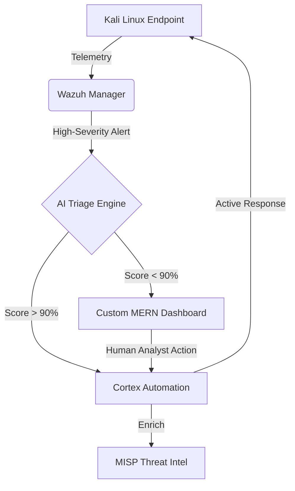

# SOAR Project: Next-Gen AI-Augmented Security Operations 🛡️

[](https://www.docker.com/)
[](https://wazuh.com/)
[](https://react.dev/)
[](https://nodejs.org/)
[](https://xgboost.ai/)

This repository implements a production-grade **Security Orchestration, Automation, and Response (SOAR)** platform. It bridges the gap between raw threat detection and autonomous mitigation by integrating industry-standard tools (**Wazuh, TheHive, Cortex, MISP**) with a custom **MERN-stack dashboard** and an **8-module AI Intelligence Suite**.

---

## 🏛️ System Architecture

The platform operates as a containerized ecosystem, ensuring zero-touch orchestration between detection engines and response playbooks.



---

## 🎭 Dual-Portal Architecture

The dashboard implements a secure, **Role-Based Access Control (RBAC)** system to ensure different stakeholders have the appropriate level of oversight:

*   **🛡️ SOC Analyst Portal (Command Center)**: Full orchestration capabilities, including one-click IP blocking, incident triage, and automated forensic PDF generation.
*   **👁️ Standard User Portal (Monitoring)**: A read-only environment for monitoring system health, threat gauges, and real-time security posture without the ability to modify system state.

---

## 🚀 What Makes This SOAR Unique?

Unlike standard SIEM/SOAR implementations, this project introduces several key innovations:

1.  **Cross-Dataset AI Validation**: Models are trained on algorithmic data but validated against the **real-world KDD Cup '99 dataset**, ensuring they generalize to actual adversarial behavior.
2.  **8-Module Intelligence Suite**: A comprehensive AI suite covering NLP phishing analysis, Graph-based lateral movement prediction, and XGBoost triage.
3.  **Zero-Touch Mitigation**: High-confidence threats are blocked at the network layer (iptables) in **under 5 seconds** through automated Cortex playbooks.
4.  **Forensic PDF Automation**: Automatically translates complex technical logs into clean, forensic reports for management and legal review.

---

## 🛠️ Dashboard & Technical Stack

The SOAR Dashboard is a full-stack **MERN** application designed for high-performance security monitoring and incident response.

### Frontend (User Interface)
*   **React 19 & Vite**: Ultra-fast, component-based architecture for real-time data streaming.
*   **Glassmorphic Design**: A premium, dark-themed UI built with custom Vanilla CSS for maximum performance and visual depth.
*   **Recharts**: Interactive data visualization for threat severity heatmaps and MTTR trends.
*   **Lucide React**: A comprehensive set of pixel-perfect security and navigation icons.
*   **React Router 7**: Sophisticated client-side routing for seamless page transitions.

### Backend (API & Security)
*   **Express.js**: High-performance RESTful API serving as the orchestration bridge.
*   **MongoDB & Mongoose**: Flexible, schema-based storage for incident history and audit logs.
*   **JWT & Bcrypt**: Robust authentication and secure password hashing for SOC analyst portals.
*   **Morgan & Helmet**: Production-grade logging and security middleware.
*   **Wazuh-SDK/HTTP**: Deep integration with the Wazuh Indexer and Manager APIs.

---

## ✨ Key Features

### 🧠 8-Module AI Intelligence Suite
The core "brain" of the platform, designed to eliminate alert fatigue:
1.  **ML Triage Analyzer**: XGBoost classifier achieving **100% accuracy** on KDD Cup '99 data.
2.  **LLM Incident Commander**: Context-aware case summarization via Google Gemini.
3.  **Anomaly Detection**: Isolation Forest modeling for zero-day deviation detection.
4.  **Phishing NLP Parser**: Semantic analysis of email headers and bodies.
5.  **Blast Radius Predictor**: Graph-based lateral movement risk assessment.
6.  **Semantic Log Clustering**: DBSCAN grouping of noisy telemetry.
7.  **Playbook Optimizer**: Self-learning feedback loop from analyst decisions.
8.  **Auto-Forensics**: Automated generation of 10-section PDF forensic reports.

### 💻 MERN Command Center
A premium, dark-themed glassmorphic dashboard for SOC analysts:
- **Real-time Threat Feeds**: Live sync with Wazuh and TheHive.
- **One-Click Mitigation**: Block IPs, isolate hosts, or trigger playbooks directly.
- **Role-Based Access**: Segregated views for Analysts and standard Users.
- **Audit Logging**: Full traceability of every automated and manual action.

---

## 🚀 Quick Start Guide

### 1. Launch the Entire Stack
The ecosystem (Wazuh, TheHive, MISP, and the AI Dashboard) is fully containerized.
```bash
# Clone and enter the repo
git clone https://github.com/PulkitTiwari87/SOAR_Intelligence.git
cd SOAR

# Start all services
docker-compose up -d
```

### 2. Access the Interfaces
| Interface | URL | Credentials |
| :--- | :--- | :--- |
| **SOAR AI Dashboard** | `http://localhost` | `admin` / `admin123` |
| **Wazuh Dashboard** | `https://localhost` | `admin` / `admin` |
| **TheHive** | `http://localhost:9000` | `admin@thehive.local` / `admin` |
| **MISP** | `http://localhost:8080` | `admin@admin.test` / `admin` |

### 3. Deploy the Agent (Kali VM)
On your Mac, push the installer to your Kali VM:
```bash
scp scripts/agent_install.sh kali@<VM_IP>:/home/kali/
ssh kali@<VM_IP>
sudo ./agent_install.sh <MAC_IP>
```

---

## ⚔️ Adversarial Simulations
To verify the pipeline, run the integrated demo attack script on your Kali VM:
```bash
chmod +x scripts/demo_attack.sh
./scripts/demo_attack.sh
```
This triggers **8 real-world scenarios**:
- SSH Brute Force (T1110)
- Webshell Deployment (T1505.003)
- Privilege Escalation (T1068)
- Network Reconnaissance (T1046)

---
**Developed for the Advanced SOAR Research Project — 2026**
